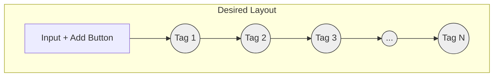

# Polish: Improve Hidden Arguments Layout

## Current Behavior
The "Hidden Arguments Configuration" section in the Settings tab displays added tags in a centered list, with the input box and "Add" button below it. This layout is not visually appealing or space-efficient.

## Desired Behavior
Improve the layout so that the input box and "Add" button are positioned on the left side. The list of added tags should appear to the right, displayed horizontally. If the list of tags becomes too long for one line, it should wrap onto subsequent lines.

## Implementation Options

1.  **Flexbox Layout:**
    *   Use a main container with `display: flex`.
    *   Place the input field and "Add" button group in one flex item (e.g., `div`).
    *   Place the container for the tags list in another flex item (e.g., `div`) with `flex-grow: 1` to take up remaining space.
    *   Set the tags list container to `display: flex` and `flex-wrap: wrap` to arrange tags horizontally and allow wrapping.
    *   Use `gap` property for spacing between tags.
    *   **Pros:** Modern, flexible, good browser support, relatively straightforward for this layout.
    *   **Cons:** Might require nested flex containers.

2.  **Grid Layout:**
    *   Use a main container with `display: grid`.
    *   Define two columns (e.g., `grid-template-columns: auto 1fr;`).
    *   Place the input/button group in the first column.
    *   Place the tags list container in the second column.
    *   Set the tags list container to `display: flex` and `flex-wrap: wrap` (similar to option 1) for the internal tag arrangement.
    *   Use `gap` property for spacing.
    *   **Pros:** Powerful for 2D layouts, can be cleaner for defining main structure.
    *   **Cons:** Might be slight overkill for this specific 1D arrangement; still requires Flexbox for the wrapping tag list itself.

3.  **Floating Layout (Less Recommended):**
    *   Wrap the input field and "Add" button in a `div` and apply `float: left`.
    *   The tags list container would naturally flow to the right.
    *   Set the tags list container to `display: flex` and `flex-wrap: wrap`.
    *   May require a clearfix on the parent container to handle the float correctly.
    *   **Pros:** Works in older browsers (if needed, though unlikely here).
    *   **Cons:** Floats are generally outdated for layout compared to Flexbox/Grid, can be harder to manage spacing, alignment, and clearing.

## Recommendation
Options 1 (Flexbox) or 2 (Grid) are recommended. Flexbox might be slightly simpler for this specific requirement.