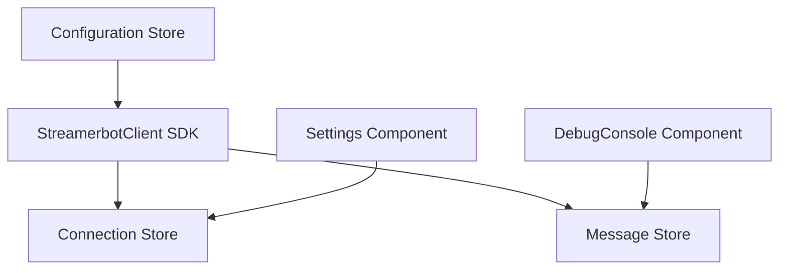

# Streamer.bot WebSocket Integration PRD

## Overview

This document outlines the implementation plan for integrating Streamer.bot's WebSocket functionality into the Twitch App Prototype using the official @streamerbot/client SDK with a centralized store architecture.

## Goals

- Establish WebSocket connection to Streamer.bot using the official SDK
- Display connection status and configuration in Settings tab
- Log Raw events in DebugConsole with proper formatting

## Technical Architecture



### 1. Core Components

#### StreamerbotClient Integration
- Utilize @streamerbot/client package
- Handle connection lifecycle through SDK
- Leverage built-in auto-reconnect functionality
- Use SDK's .on() event handler for Raw events
- Process messages through SDK event handlers

#### Stores
1. Connection Store
   - Connection status (from SDK events)
   - Connection timestamp
   - Error state
   - Latency metrics

2. Configuration Store
   - Host settings (default: 127.0.0.1)
   - Port settings (default: 8080)

3. Message Store
   - Maintains action execution logs
   - Handles message formatting
   - Integrates with existing debug console

### 2. User Interface

#### Settings Tab Updates
- Connection Status Display
  * Status indicator (Connected/Disconnected)
  * Connection uptime
  * Error display
  * Visual status indicator (green/red)

- Configuration Section
  * Host input field
  * Port input field
  * Connect/Disconnect button
  * Clear error button

#### Debug Console Updates
- New message format for Raw events:
  * Actions: `ACTION: <actionname> Args: key1: "value1", key2: "value2"` (values > 20 chars truncated)
  * Sub-actions: `[ParentActionName] <subactionname> Args: key1: "value1", key2: "value2"` (values > 20 chars truncated)

## Implementation Plan

### Phase 1: SDK Integration
1. Install @streamerbot/client package
2. Create SDK wrapper service
3. Implement connection and configuration stores
4. Set up event handler for Raw events

### Phase 2: Settings UI
1. Add connection status display
2. Implement configuration inputs
3. Add connection controls

### Phase 3: Debug Integration
1. Update message store for Raw events
2. Implement message formatting
3. Integrate with existing debug console

### Phase 4: Testing & Polish
1. Test connection handling
2. Verify message formatting
3. Test error scenarios
4. Add loading states and transitions

## Technical Specifications

### SDK Integration Service
```typescript
import { StreamerbotClient } from '@streamerbot/client';

class StreamerbotService {
  private client: StreamerbotClient;

  constructor(config: ConnectionConfig) {
    this.client = new StreamerbotClient({
      host: config.host,
      port: config.port
    });

    // Subscribe to Raw events using the SDK's .on() method
    this.client.on('Raw', this.handleRawEvent.bind(this));
  }

  private handleRawEvent(data: ActionEvent | SubActionEvent): void {
    // Format and store the event
  }
}

// Raw Event Types (based on Streamer.bot WebSocket API)
interface ActionEvent {
  id: string;
  name: string;
  arguments: Record<string, any>;
  user: {
    id: number;
    login: string;
    display_name: string;
    subscribed: boolean;
    role: number;
  };
}

interface SubActionEvent {
  parentId: string;
  parentName: string;
  type: number;
  id: string;
  name: string;
  arguments: Record<string, any>;
  user: {
    id: number;
    login: string;
    display_name: string;
    subscribed: boolean;
    role: number;
  };
}
```

### Store Structures
```typescript
interface ConnectionState {
  isConnected: boolean;
  error: string | null;
  connectedAt: Date | null;
  lastError: Date | null;
}

interface ConfigurationState {
  host: string;
  port: number;
}

interface FormattedMessage {
  type: 'action' | 'subaction';
  timestamp: Date;
  content: string;
}
```

## Success Criteria

1. **Functionality**
   - Stable WebSocket connection via SDK
   - Raw events properly subscribed and handled
   - Accurate event message formatting
   - Values > 20 characters properly truncated

2. **Performance**
   - Quick connection establishment
   - Responsive UI updates
   - Efficient message processing

3. **Reliability**
   - Graceful error handling
   - Successful reconnection
   - No message loss

## SDK-Specific Features Utilized

1. Automatic event subscription through .on() method
2. Built-in connection management
3. Type-safe event handling
4. Automatic reconnection

## Future Considerations

1. Support for additional event types
2. Message filtering capabilities
3. Advanced configuration options
4. Message search functionality
5. Connection statistics

## Dependencies

- @streamerbot/client: Latest version
- Existing Svelte stores infrastructure
- Current debug console implementation