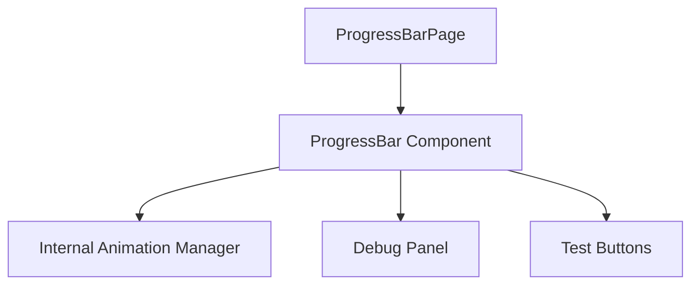
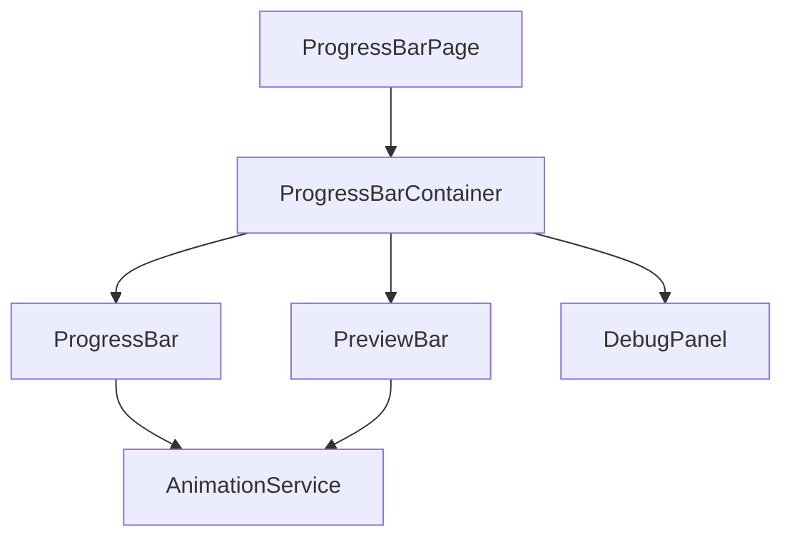
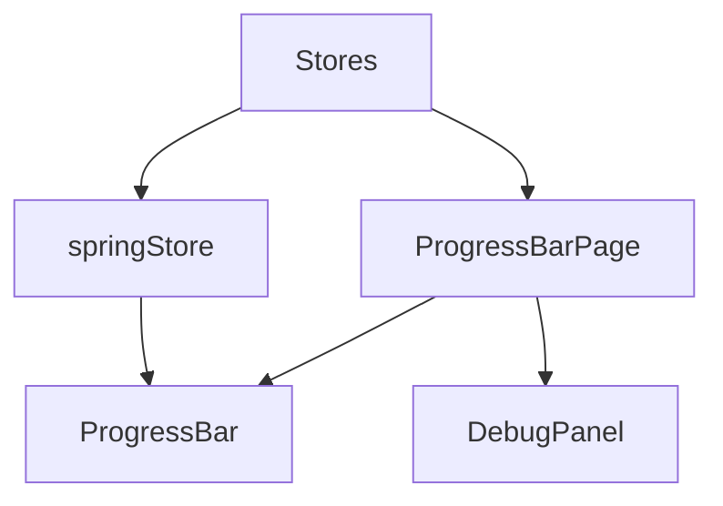

# Progress Bar Feature - Architecture Approaches

## 1. Single Component with Internal Animation State

### Overview
A monolithic approach where the ProgressBar component handles all functionality internally.

### Implementation

### Pros
- Simpler implementation with all logic contained in one place
- Easier to manage the tight coupling between the progress bar and its preview animation
- Direct access to DOM elements for precise animation control

### Cons
- Less reusable as animation logic is tightly coupled
- More complex component with multiple responsibilities
- Harder to test individual pieces
- More challenging to maintain as feature grows

## 2. Composable Components with Animation Service

### Overview
Split functionality into smaller, focused components with a dedicated animation service.

### Pros
- Better separation of concerns
- More reusable components
- Easier to test individual parts
- Animation logic can be shared across components
- More maintainable as features grow

### Cons
- More complex initial setup
- Requires careful state management between components
- May need additional coordination for preview/main bar synchronization

## 3. Store-Driven Architecture with Spring Animations

### Overview
Leverage Svelte stores for all state management and use spring animations for smooth transitions.

### Implementation Details
- Use Svelte's built-in spring() for smooth animations
- All state managed through stores
- Preview animation handled through derived stores

### Pros
- Most reactive approach
- Spring animations provide smooth, natural feeling
- Excellent state management and predictability
- Easy to debug with centralized state

### Cons
- More complex state management
- Spring animations might not provide exact control needed for preview effect
- Higher learning curve for developers