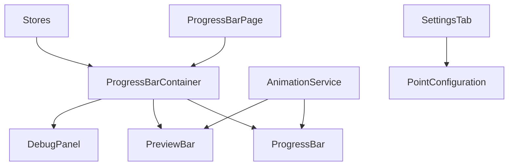

# Progress Bar Feature PRD

## Overview
Implement a dynamic progress bar feature for tracking beard and shave points, with preview animations and debug capabilities.

## Development Guidelines
- All code files must be 500 lines or less
- Large components must be split into smaller, focused components
- Point configuration settings belong in the Settings tab
- Debug panel should focus on information display and testing

## Goals
- Create an intuitive visual representation of point progress
- Provide smooth, engaging animations with preview functionality
- Enable easy debugging and testing through a dedicated panel
- Maintain clean separation of concerns for future maintainability

## Technical Specifications

### Component Structure


### Components

#### 1. ProgressBarContainer
- **Purpose**: Main orchestrator component
- **Responsibilities**:
  - Layout management
  - State coordination between child components
  - Debug panel visibility control

#### 2. ProgressBar
- **Purpose**: Primary progress visualization
- **Properties**:
  - Current progress (0-5000 for each side)
  - Total capacity (5000 points per side)
  - Side indicator (beard/shave)
- **Features**:
  - Smooth animation transitions
  - Color-coded sides
  - Progress percentage display

#### 3. PreviewBar
- **Purpose**: Show pending point changes
- **Features**:
  - Semi-transparent overlay
  - Immediate visual feedback
  - Synchronized with main bar

#### 4. DebugPanel
- **Purpose**: Testing and monitoring
- **Features**:
  - Current points display
  - Test buttons for adding points
  - Reset button to clear progress
  - Real-time store value monitoring

### Stores

#### 1. pointConfiguration (in Settings Tab)
```typescript
interface PointConfig {
  // Bits (points awarded per 100 bits)
  hundredBits: number;     // Example: 100 points per 100 bits

  // Subscriptions
  // Note: These all use the same base configuration
  // - Prime subs
  // - Tier 1 subs
  // - Gift subs (individual)
  subPoints: number;          // Base points for any sub
  
  // Special Cases
  tier2Multiplier: number;    // Multiplier for Tier 2 (e.g., 2x base points)
  tier3Multiplier: number;    // Multiplier for Tier 3 (e.g., 3x base points)
  giftBombBonus: number;      // Additional points for gift bombs (10+ subs)

  // Resubs
  resubMultiplier: number;    // Multiplier for resubs (e.g., 1.5x base points)
  streakBonus: number;        // Additional points for maintaining streak

  // General
  defaultTarget: number;      // Default target (5000 per side)
}
```

#### 2. progressStores
```typescript
totalBeardPoints: Writable<number>;    // Current beard points
totalShavePoints: Writable<number>;    // Current shave points
userPendingPoints: Writable<{          // Pending points by user
  [userId: string]: number;            // Single number of pending points
}>;
```

### Animation Service
- **Purpose**: Handle all animation logic
- **Features**:
  - Transition timing (0.3s smooth slide)
  - Preview handling
  - Animation coordination
- **Methods**:
  - `animateProgress(current: number, target: number)`
  - `showPreview(amount: number)`
  - `resetPreview()`

## User Interface

### Progress Bar Tab Layout
```
+------------------------+
|     Progress Bar       |
+------------------------+
| Debug Panel           |
| - Current Points      |
| - Add Points Buttons  |
| - Reset Button        |
| - Real-time Values    |
+------------------------+
```

### Settings Tab Layout
```
+------------------------+
| Point Configuration   |
| - Bits per 100        |
| - Sub Base Points     |
| - Tier Multipliers    |
| - Other Settings      |
+------------------------+
```

## Implementation Requirements

### Phase 1: Core Components
1. Set up basic component structure
2. Create stores for point tracking
3. Implement progress bar visualization
4. Add debug panel with reset functionality

### Phase 2: Animation
1. Implement AnimationService
2. Add preview functionality
3. Fine-tune transitions

### Phase 3: Settings Integration
1. Move point configuration to Settings tab
2. Implement configuration UI
3. Add configuration persistence

## Success Metrics
- Smooth animations (60 FPS)
- Accurate point tracking
- Responsive preview updates
- Clear debug information
- All files under 500 lines