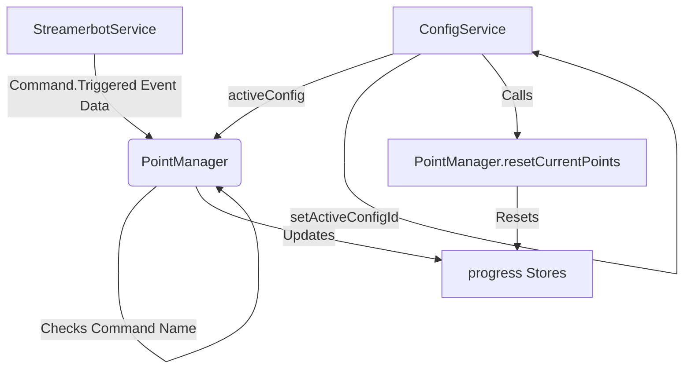
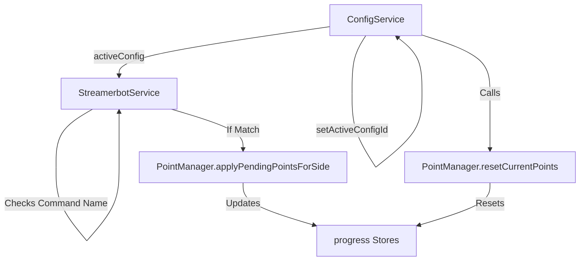

# Architecture Brainstorm: Left/Right Command Integration (v2)

This document explores different approaches for integrating `LeftCommand` and `RightCommand` into the progress bar configuration feature.

**Goal:** Allow users to define custom commands (e.g., `!left`, `!right`) per configuration, which trigger the application of pending points for the corresponding side when the command is triggered via Streamer.bot. This replaces the hardcoded `!beard` and `!shave` logic.

**Key Requirements & Decisions:**

*   **UI:** Add `LeftCommand` and `RightCommand` text inputs to the configuration editor UI within distinct "Left" and "Right" sections.
*   **Format:** Commands are case-insensitive and must start with `!`. These commands will be configured as triggers within Streamer.bot itself.
*   **Activation:** Only commands from the *currently active* configuration trigger point allocation within the SvelteKit app. Streamer.bot will send a `Command.Triggered` event regardless, but the app will only act on it if it matches the active config.
*   **State Change:** When the active configuration changes:
    *   Any points currently applied to the progress bar are removed (resetting the bar visually).
    *   Pending points remain queued for users.
    *   Subsequent `Command.Triggered` events must match the *new* active configuration's commands to apply pending points.
*   **Detection:** The system needs to receive the `Command.Triggered` event from Streamer.bot, extract the command name and user info, check if the command name matches the active configuration's `LeftCommand` or `RightCommand` (case-insensitively), and trigger the `PointManager` to apply the corresponding user's pending points to the correct side (`totalLeftSidePoints` or `totalRightSidePoints`).
*   **Reset Logic:** When the active configuration changes (`ConfigService.setActiveConfigId`), the `ConfigService` should trigger a reset of the current points (`PointManager.resetCurrentPoints()`) to clear `totalLeftSidePoints` and `totalRightSidePoints`.

## Implementation Approaches

*(Note: Approaches 1 & 2 are updated to reflect using Command.Triggered, though Approach 3 is the chosen one)*

### Approach 1: Enhance `PointManager`

*   **Summary:** Keep command detection logic within the `PointManager`. `StreamerbotService` forwards relevant data from the `Command.Triggered` event (command name, user info). `PointManager` subscribes to the `activeConfig` store from `ConfigService` and performs the command matching within its event handling logic.
*   **Pros:**
    *   Keeps point-related command logic consolidated within the `PointManager`.
    *   Requires fewer changes to `StreamerbotService`.
*   **Cons:**
    *   Increases the responsibilities of `PointManager`.
    *   `PointManager` needs a direct dependency on `ConfigService`.
    *   Less separation of concerns.



### Approach 2: Enhance `StreamerbotService`

*   **Summary:** Move command detection logic into `StreamerbotService`. It subscribes to `activeConfig` from `ConfigService`. Upon receiving a `Command.Triggered` event, it extracts the command name, checks against the active commands. If a match occurs, it calls `PointManager.applyPendingPointsForSide(userId, side: 'left' | 'right')`.
*   **Pros:**
    *   Better separation of concerns than Approach 1.
    *   `PointManager` API is simpler regarding command handling.
*   **Cons:**
    *   Increases the complexity of `StreamerbotService`.
    *   `StreamerbotService` needs a dependency on `ConfigService`.



### Approach 3: Introduce `CommandService` (Chosen Approach)

*   **Summary:** Create a new dedicated `CommandService`. `StreamerbotService` forwards relevant data from the `Command.Triggered` event (command name, user info) to this new service. `CommandService` subscribes to `activeConfig` from `ConfigService` and performs the command matching (case-insensitive check against `activeConfig.leftCommand` / `rightCommand`). If a match occurs, it calls `PointManager.applyPendingPointsForSide(userId, side: 'left' | 'right')`.
*   **Pros:**
    *   Excellent separation of concerns: `StreamerbotService` (connection/raw events), `CommandService` (command interpretation), `PointManager` (point logic), `ConfigService` (configuration state).
    *   Makes `StreamerbotService` and `PointManager` simpler.
    *   Highly modular and potentially easier to test/maintain.
*   **Cons:**
    *   Introduces a new service class, adding slightly more structural overhead.
    *   Requires defining the interface/interaction between `StreamerbotService` and `CommandService`.

```mermaid
graph TD
    A[StreamerbotService] -- Command.Triggered Event Data --> E(CommandService);
    C[ConfigService] -- activeConfig --> E;
    E -- Checks Command Name --> E;
    E -- If Match --> B_Apply[PointManager.applyPendingPointsForSide];
    B_Apply -- Updates --> D[progress Stores];
    C -- setActiveConfigId --> C;
    C -- Calls --> B_Reset[PointManager.resetCurrentPoints];
    B_Reset -- Resets --> D;