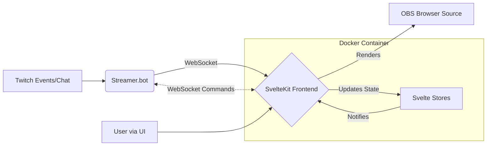

# Project Technical Design: Twitch App Prototype (Beard or Shave)

## 1. Overview

This document outlines the technical design and architecture of the Twitch App Prototype, an interactive SvelteKit-based application designed for Twitch streams. The core concept involves a visual progress bar influenced by viewer interactions (bits, subscriptions) via Streamer.bot, initially themed around a "Beard or Shave" goal.

The application features a multi-tab interface (Progress Bar, Settings, Debug), utilizes centralized Svelte stores for state management, integrates deeply with Streamer.bot via its WebSocket SDK, and includes comprehensive debugging and configuration options. The entire application is containerized using Docker for consistent development and deployment.

## 2. System Architecture

The system consists of the following main components:

1.  **SvelteKit Frontend:** A modern web application built with SvelteKit, providing the user interface (tabs, progress bar visualization, settings forms, debug console). It runs in a browser source within OBS.
2.  **Streamer.bot:** Acts as the backend logic controller, listening to Twitch events (bits, subs, etc.) and chat commands. It communicates with the SvelteKit frontend via WebSocket.
3.  **WebSocket Communication:** The primary communication channel between Streamer.bot and the SvelteKit frontend. The frontend uses the `@streamerbot/client` SDK to establish and manage this connection.
4.  **Docker Environment:** The application is containerized using Docker, with separate configurations for development (`docker-compose.dev.yaml`, `Dockerfile.dev`) and production (`docker-compose.yaml`, `Dockerfile`) to ensure consistency.



## 3. Key Technical Decisions

*   **Framework:** SvelteKit - Chosen for its reactivity, performance, and component-based structure.
*   **State Management:** Centralized Svelte Stores (`writable`) - Used extensively for managing application state (connection status, configuration, debug messages, progress points, pending points, debug settings). This promotes decoupling and easier state sharing across components. Initial persistence is in-memory per session, with `localStorage` noted for future enhancements and used for some configurations like `pointConfiguration`.
*   **Backend Integration:** Streamer.bot WebSocket SDK (`@streamerbot/client`) - Provides real-time, bidirectional communication for receiving events and potentially sending commands back to Streamer.bot. This replaced the initial HTTP suggestion from `design-v1.md`.
*   **Event Handling:** Type-safe event handling for Streamer.bot events, using defined TypeScript interfaces (e.g., `TwitchSubData`, `ChatMessage`). Specific event subscriptions (Cheers, Subs, Fourth Wall events like `Fourthwall.Donation`, etc.) are managed within the `StreamerbotService`. Dynamic subscription management based on debug settings is implemented. Fourth Wall events are routed to `FourthWallService` for initial logging.
*   **Point System:**
    *   Separate tracking of `totalBeardPoints` and `totalShavePoints`.
    *   Proportional calculation based on configurable ratios and totals, supporting decimal precision.
    *   Point Queuing (`PointManager` service, `userPendingPoints` store) for events that don't immediately trigger allocation (e.g., subs without a `!beard`/`!shave` command). Includes methods (`removePendingPointsForUser`, `clearAllPendingPoints`) for manual removal via the UI.
    *   Correct handling of `cumulativeTotal` and `durationMonths` for gift subs.
*   **Debugging:**
    *   Dedicated Debug tab with `DebugConsole`.
    *   Color-coding for different event types in the console.
    *   Persistent message store (`messages.ts`) for history across tab switches.
    *   Conditional logging based on Debug Settings (e.g., `enableApiDebugging`, `enableCheerEvent`).
    *   "Smart" auto-scrolling in the Debug Console.
    *   Pending points display with controls to remove individual entries or clear all points (`DebugPanel` interacting with `PointManager`).
*   **Configuration:** Dedicated Settings tab with forms (`PointConfigForm`, `DebugSettingsForm`, connection settings) linked to persistent configuration stores. Includes settings for base point values, multipliers, and Fourth Wall event points.
*   **Styling:** Uses a global stylesheet (`src/styles.css`) for base styles (reset, dark theme), navigation tabs, debug console (including custom scrollbar and color-coding for `.points`, `.bits`, `.sub`), and basic section layouts. Component-specific styles may also exist within `.svelte` files.
*   **Containerization:** Uses Docker with separate dev/prod configurations. Development setup supports hot-reloading via volume mounts. Production uses a multi-stage build with Nginx serving static files.
*   **Code Structure:** Clear separation using Services (`StreamerbotService`, `TwitchChatService`, `PointManager`, `FourthWallService`), Stores (`stores/`), Components (`components/`), and Utilities (`utils/`).
*   **Tooling:** Key dependencies include `@streamerbot/client`, SvelteKit, and Vite. Uses static adapter for SPA output and strict TypeScript configuration.

## 4. Design Patterns

*   **Centralized State Management (Store Pattern):** Svelte Stores act as the single source of truth for shared application state.
*   **Observer Pattern:** Svelte's reactivity system inherently implements this. Components subscribe to stores and automatically update when the store's value changes.
*   **Service Layer:** Encapsulating business logic and external communication (e.g., WebSocket handling, point calculations, Fourth Wall event logging) within dedicated service classes (`StreamerbotService`, `PointManager`, `TwitchChatService`, `FourthWallService`).
*   **Component-Based Architecture:** Leveraging Svelte's component model to build the UI.
*   **Dependency Injection (Implicit via Modules):** Services and stores are typically imported as modules where needed.
*   **Configuration Management:** Storing user-configurable settings in dedicated stores, allowing easy access and modification throughout the application.
*   **Utility Functions:** Grouping reusable helper functions (e.g., `numberFormat.ts`, `points.ts`).

## 5. Component & Service Relationships (High-Level)

*   **`+layout.svelte` (Root Layout Component):**
    *   Provides the main application structure:
    *   Initializes and manages tab navigation state (`activeTab` store)
    *   Mount handler with debug logging
    *   Tab switching functionality via `handleTabClick()`
    *   Navigation bar with three tabs:
        - Progress Bar
        - Settings
        - Debug
    *   Delays slot rendering until mounted to avoid hydration issues
    *   Imports global styles (`styles.css`)
*   **`+page.svelte` (Root Page Component):**
    *   Manages main content switching between tabs via `activeTab` store
*   **`settings/+page.svelte` (Settings Page):**
    *   Dedicated page for application settings
    *   Contains organized sections for:
        - General settings (placeholder for future features)
        - Point configuration (renders `PointConfigForm`)
    *   Clean, responsive layout with card-based design
    *   Consistent styling with other pages
    *   Conditional rendering of tab content:
        - `ProgressBarContainer` for 'progress' tab
        - `SettingsTab` for 'settings' tab
        - `DebugConsole` for 'debug' tab
    *   Handles responsive layout and scrolling
    *   Includes tab-specific styling configuration
*   **Tabs:**
    *   **`Settings` (`src/lib/SettingsTab.svelte`):** Orchestrates the settings UI. Imports and renders `PointConfigForm` and `DebugSettingsForm`. Manages Streamer.bot connection UI (host/port inputs, status display, connect/disconnect buttons) by interacting with the `connection` and `config` stores (from `stores/streamerbot`) and calling `StreamerbotService` methods. Also includes UI for managing hidden arguments stored in the `config` store.
        *   `DebugSettingsForm` (`src/lib/components/settings/DebugSettingsForm.svelte`): Provides UI (checkboxes, text input) for debug settings (`subscribeToCheerEvents`, `enableApiDebugging`, `testMessage`). Reads from and saves to the `debugSettings` object within the main `config` store. Calls `StreamerbotService.toggleCheerSubscription()` on save if the cheer setting changed.
        *   `PointConfigForm` (`src/lib/components/settings/PointConfigForm.svelte`): Provides UI (number inputs) for configuring point values (bits, subs, multipliers, bonuses, Fourth Wall events, total progress points). Reads from and saves to the `pointConfiguration` store (`$lib/stores/progress`). Includes validation and a reset-to-defaults function. Contains a dedicated "FourthWall Rewards" section.
    *   **`Debug`:**
        *   `DebugConsole` (`src/lib/DebugConsole.svelte`): Subscribes to the `messages` store to display logs. Implements "smart" auto-scrolling (only scrolls if user is near the bottom) using lifecycle functions and scroll events. Renders messages applying dynamic CSS classes (`.bits`, `.sub`) based on `message.type` for color-coding. Contains component-specific styles (including redundant color definitions) and leftover test code.
    *   **`Progress Bar` (`src/routes/progress/+page.svelte`):**
        *   Dedicated page for progress bar display
        *   Sets active tab to 'progress' on mount
        *   Renders `ProgressBarContainer` component
        *   Includes global style overrides:
            - Dark theme background
            - System font stack
            - Reset margins
        *   `ProgressBarContainer` (`src/lib/components/ProgressBarContainer.svelte`): Wraps the `ProgressBar` and `DebugPanel`. Subscribes to `totalBeardPoints` and `totalShavePoints` stores and passes them as props to `ProgressBar`. Includes logic for handling mouse events to potentially show a preview on the `ProgressBar` (though `previewAmount` is currently hardcoded to 0).
        *   `DebugPanel` (`src/lib/components/DebugPanel.svelte`): Provides interactive debugging UI. Displays current point totals (`totalBeardPoints`, `totalShavePoints`) and calculated bar position (derived from points and `pointConfiguration`). Includes controls to add test points (updating `totalBeardPoints`, `totalShavePoints`, and `actionHistory` stores) and reset progress. Displays action history (from `actionHistory` store) and pending points (from `userPendingPoints` store), using `formatNumber` utility. Includes controls ('x' icon per entry, "Clear All" button) to remove pending points by calling `PointManager.removePendingPointsForUser` or `PointManager.clearAllPendingPoints`. Also includes a slider to control UI padding via the `uiSettings` store. Contains extensive component-specific styles.
        *   `ProgressBar` (`src/lib/components/ProgressBar.svelte`): Renders the visual progress bar. Takes `beardPoints` and `shavePoints` as props. Reads `totalProgressPoints` from the `pointConfiguration` store. Calculates the bar percentage based on the net point difference relative to the total, starting from 50%. Uses `animationService` to animate width changes. Conditionally shows a preview overlay based on `showPreview` and `previewAmount` props. Contains component-specific styles for appearance (red/blue colors, labels).
*   **Services:**
    *   `StreamerbotService` (`src/lib/services/StreamerbotService.ts`): Manages WebSocket connection using `@streamerbot/client` (Singleton). Handles connect/disconnect lifecycle, updating `connection` store. Subscribes to Twitch events (`ChatMessage`, `Sub`, `ReSub`, `GiftSub`, `GiftBomb`), Command events (`Triggered`), and Fourth Wall events (`Fourthwall.Donation`, `Fourthwall.GiftPurchase`, `Fourthwall.OrderPlaced`) on connect. Dynamically manages `Twitch.Cheer` subscription via `toggleCheerSubscription` based on `debugSettings`, requiring reconnect. Routes events to handlers (`handleSubEvent`, etc.) which parse data, log to `messages` store (conditionally based on `enableApiDebugging`), and delegate to `PointManager` (for points events), `TwitchChatService` (for chat), `FourthWallService` (for Fourth Wall events), or `PointManager.applyQueuedPoints` (for commands). Formats arguments for logging, respecting `hiddenArgs` from `config` store. Instantiates `FourthWallService`.
    *   `TwitchChatService` (`src/lib/services/TwitchChatService.ts`): Specifically processes `Twitch.ChatMessage` events received from `StreamerbotService` (Singleton). Filters for messages containing bits (`message.hasBits`). Extracts bit amount and user info, then delegates point handling to `PointManager.handleBitsCheer`. Logs messages conditionally based on `enableApiDebugging` setting in `config` store.
    *   `PointManager` (`src/lib/services/PointManager.ts`): Central service for point logic (Singleton). Subscribes to `pointConfiguration`. Handles events (`handleBitsCheer`, `handleSubscription`, `handleGiftBomb`), calculates points (delegating to `utils/points.ts`), checks for commands (`!beard`/`!shave`), and either updates `totalBeardPoints`/`totalShavePoints` directly or queues points in `userPendingPoints` via `queuePointsForUser`. Applies queued points via `applyQueuedPoints` when a command is received later. Includes methods `removePendingPointsForUser` and `clearAllPendingPoints` for manual removal, triggered by `DebugPanel`. Logs calculations to `messages` store and applied actions to `actionHistory` store.
    *   `FourthWallService` (`src/lib/services/FourthWallService.ts`): Handles incoming Fourth Wall events (`Donation`, `GiftPurchase`, `OrderPlaced`) received from `StreamerbotService` (Singleton). Its primary function currently is to log the raw event payload to the `messages` store for debugging and analysis.
    *   `AnimationService` (`src/lib/services/AnimationService.ts`): Provides smooth animation using `requestAnimationFrame`. Exports a singleton instance (`animationService`). Used by `ProgressBar` to animate width changes based on an ease-out cubic function over a fixed duration. Includes methods for preview animations.
*   **Stores:** (`stores/`) Provide reactive state for:
    *   `streamerbot` (`src/lib/stores/streamerbot.ts`): Contains stores for Streamer.bot connection and configuration:
        *   `connection`: Manages WebSocket connection state with:
            - `isConnected`: boolean
            - `error`: string | null
            - `connectedAt`: Date | null
            - `lastError`: Date | null
            - Methods: `setConnected()`, `setDisconnected()`, `reset()`
        *   `config`: Persistent configuration with:
            - `host` (string)
            - `port` (number)
            - `hiddenArgs`: Argument names to hide in debug logs
            - `debugSettings`: Configuration controlling debug output
            - Methods: `updateConfig()`, `reset()`
            - Uses localStorage persistence with default fallback values
    *   `messages` (`src/lib/stores/messages.ts`): Custom store holding an array of `DebugMessage` objects (text, type, timestamp) for the debug console. Provides `addMessage` (appends) and `clear` methods. Used by `DebugConsole` for display and various services (`StreamerbotService`, `PointManager`, `TwitchChatService`) for logging.
    *   `progress` (`src/lib/stores/progress.ts`): Contains core progress tracking stores:
        *   `totalBeardPoints`: Writable<number> tracking accumulated beard points
        *   `totalShavePoints`: Writable<number> tracking accumulated shave points
        *   `userPendingPoints`: Writable<{[userId: string]: PendingPointsEntry}> tracking unallocated points per user
        *   `pointConfiguration`: Persisted Writable<PointConfig> with:
            - Bits conversion (hundredBits)
            - Sub points (subPoints, tier multipliers)
            - Gift bomb bonuses (giftBombBonus)
            - Resub multipliers (resubMultiplier)
            - Default targets (defaultTarget, totalProgressPoints)
            - Fourth Wall points (`fourthwallDonationPointsPerDollar`, `fourthwallGiftPurchasePoints`, `fourthwallOrderPlacedPoints`)
            - Uses localStorage persistence with default fallback
    *   `debugSettings`: Toggles for features like `enableApiDebugging`, `enableCheerEvent`.
    *   `activeTab` (`src/lib/stores.ts`): Tracks the currently active UI tab ('progress', 'settings', 'debug'), initialized to 'settings'. Uses a custom store wrapper (`createActiveTabStore`) which includes commented-out debug logging hooks.
    *   `actionHistory` (`src/lib/stores/actionHistory.ts`): Custom store holding an array of `ProgressAction` objects (type, points, target, timestamp). Actions are prepended via `addAction` for reverse chronological order. Used by `PointManager` and `DebugPanel`. Includes a `clear` method.
    *   `uiSettings` (`src/lib/stores/uiSettings.ts`): Manages UI layout preferences:
        *   `verticalPadding`: Controls vertical spacing (default 60px)
        *   Used by DebugPanel to adjust layout spacing
*   **Utilities:** (`utils/`)
    *   `points.ts`: Contains functions for calculating points based on events and configuration.
    *   `numberFormat.ts`: Formats numbers for display.
*   **Key Utilities:**
*   `points.ts`: Calculates points from Twitch events (bits, subs), applying multipliers and bonuses
*   `numberFormat.ts`: Formats numeric displays while handling edge cases
*   `debug.ts`: Provides centralized, component-aware logging
*   **Type Definitions (`src/lib/types/twitch.ts`):**
    *   Defines TypeScript interfaces for all Twitch event structures:
        *   `TwitchUser`: User identity/subscription status
        *   Event payload types for each Twitch event (Cheers, Subs, etc.)
        *   Detailed chat message structure (`TwitchChatMessageData`)
        *   Specialized command payload (`CommandPayload`)
        *   Point-related interfaces (`PointCalculation`, `QueuedPoints`)
        *   Detailed data interfaces for each event type with:
            - User/bits information
            - Subscription tiers
            - Gift metadata
            - Testing flags

```mermaid
graph TD
    subgraph UI Components
        direction LR
        TabNav --> SettingsTab
        TabNav --> DebugTab
        TabNav --> ProgressBarTab

        SettingsTab --> ConnectionForm
        SettingsTab --> PointConfigForm
        SettingsTab --> DebugSettingsForm

        DebugTab --> DebugConsole

        ProgressBarTab --> ProgressBarContainer --> ProgressBar
        ProgressBarContainer --> DebugPanel
    end

    subgraph Services
        StreamerbotService
        TwitchChatService
        PointManager
        FourthWallService
    end

    subgraph Stores
        direction LR
        Store_Connection[streamerbot]
        Store_Config[configuration]
        Store_Messages[messages]
        Store_Progress[progress]
        Store_Pending[userPendingPoints]
        Store_PointConfig[pointConfiguration (incl. FW)]
        Store_DebugSettings[debugSettings]
    end

    subgraph Utilities
        Util_Points[points.ts]
        Util_NumberFormat[numberFormat.ts]
    end

    %% Connections
    ConnectionForm --> Store_Config
    PointConfigForm --> Store_PointConfig
    DebugSettingsForm --> Store_DebugSettings

    DebugConsole --> Store_Messages
    DebugPanel --> Store_Pending
    DebugPanel --> Store_Progress
    DebugPanel --> PointManager

    ProgressBar --> Store_Progress

    StreamerbotService --> Store_Connection
    StreamerbotService --> Store_Config
    StreamerbotService --> Store_Messages
    StreamerbotService --> Store_DebugSettings
    StreamerbotService --> PointManager
    StreamerbotService -- Uses --> SDK[@streamerbot/client]
    StreamerbotService --> FourthWallService

    TwitchChatService --> Store_Messages
    TwitchChatService --> Store_DebugSettings

    PointManager --> Store_Progress
    PointManager --> Store_Pending
    PointManager --> Store_PointConfig
    PointManager -- Uses --> Util_Points

    FourthWallService --> Store_Messages

    DebugPanel -- Uses --> Util_NumberFormat
    ProgressBar -- Uses --> Util_NumberFormat

    %% User Interaction
    User --> ConnectionForm
    User --> PointConfigForm
    User --> DebugSettingsForm
    User --> DebugPanel

    %% External
    Streamerbot --> StreamerbotService

```

